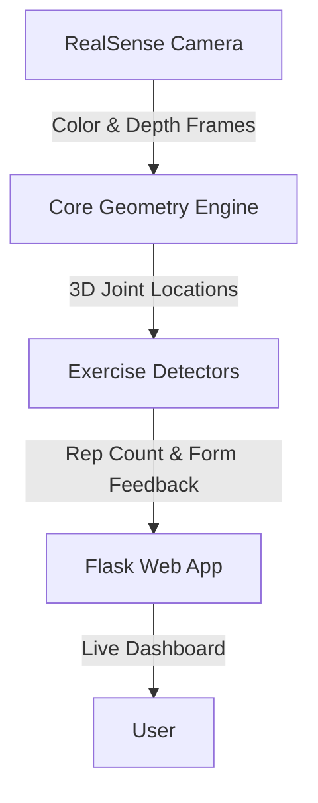

# Smart Mirror Exercise Tracker

This is a web-based app that tracks your exercise form in real-time. It uses a RealSense depth camera to map your body in 3D and MediaPipe to detect your joints. The app counts your reps and gives you live feedback on your form (like telling you to go lower in a squat).

## Architecture & Speed

The app is built using a simple flow. The camera feeds images to the core geometry engine, which calculates the 3D position of your joints. These joints are passed to a specific exercise detector (like a squat detector), which counts your reps and checks your form. Finally, the feedback is sent to the web dashboard.



### Technical Optimizations

To ensure the system runs at high framerates with minimal latency, we implemented several key optimizations:

- **Deterministic Geometric Heuristics**: Instead of relying on computationally expensive deep learning classifiers to validate movement patterns, we use deterministic 3D vector mathematics. This allows us to instantly evaluate complex biomechanics with virtually zero overhead.
- **Asynchronous Multi-threading**: The heavy computer vision pipeline (RealSense stream alignment and MediaPipe inference) is entirely decoupled from the main Flask web server using asynchronous daemon threads. This prevents blocking and guarantees a highly responsive UI.
- **Low-Latency MJPEG Streaming**: Real-time frame buffers are encoded efficiently via OpenCV and streamed over a multi-part HTTP boundary. This minimizes network overhead and browser decoding latency, making the live feed feel instantaneous.
- **Exponential Moving Average (EMA) Filtering**: High-frequency depth sensor noise is attenuated in real-time using a custom EMA low-pass filter. This provides perfectly smooth joint telemetry with sub-millisecond computational cost.

## Folder Structure

The codebase is organized into a modular Python package structure:

- **`code/app.py`**: The main Flask server entrypoint. Run this to start the app.
- **`code/core/`**: Contains the abstract base classes, configuration loader, and core geometry engine.
- **`code/detectors/`**: Contains the decoupled logic for specific exercises (squats, pendulums, shoulder circles, etc.).
- **`code/tools/`**: Standalone scripts for performance profiling and validation.

## How to Run

1. Make sure you have your RealSense camera connected.
2. Install the required Python packages (like `flask`, `pyrealsense2`, `mediapipe`, `opencv-python`).
3. Run the main app file from your terminal:

```bash
cd code
python app.py
```

4. The terminal will ask you to select which exercise you want to do. Type a number and press Enter.
5. Open your web browser and go to `http://127.0.0.1:5000` to see the live tracking dashboard!

## Adding a New Exercise

To add a new exercise:
1. Create a new detector file inside `code/detectors/`.
2. Make your new class inherit from `BaseExercise`.
3. Add your new exercise to `EXERCISE_REGISTRY` in `code/core/exercise_utils.py` and update the `exercises_config.json`.
