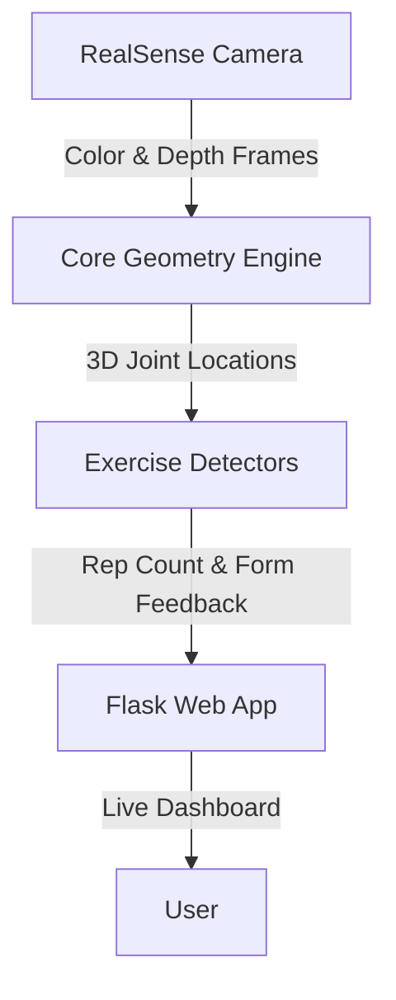

# Smart Mirror Exercise Tracker

[](https://github.com/manas23sanam/eyantra_miraze/actions/workflows/tests.yml)
[](LICENSE)

A web-based app that tracks your exercise form in real time. It uses an Intel RealSense depth camera to place your joints in 3D and MediaPipe Pose to detect them. The app counts your reps and gives live feedback on your form (for example, telling you to go lower in a squat).

Supported exercises: mini squat, full squat, pendulum, shoulder circle, sit-to-stand, and upper trapezius stretch.

## Architecture

The camera feeds frames to the core geometry engine, which turns 2D landmarks into 3D joint positions using the depth map. A per-exercise detector uses those joints to count reps and check form, and the result is streamed to the web dashboard.


```mermaid
graph TD
    A[RealSense Camera] -->|Color & Depth Frames| B[Core Geometry Engine]
    B -->|3D Joint Locations| C[Exercise Detectors]
    C -->|Rep Count & Form Feedback| D[Flask Web App]
    D -->|Live Dashboard| E[User]
```

### Design choices

- **Geometric rules instead of a classifier.** Form is checked with 3D joint angles and distances (knee angle, left/right asymmetry, knee width, torso lean), so each rule is explainable and cheap to compute.
- **Robust depth sampling.** Each joint's depth is the median of the valid pixels in a 5×5 window, so sensor holes and single noisy pixels don't drop or distort a joint.
- **Smoothing.** An exponential moving average filters jitter in the measured angles before the rep state machine sees them.
- **Background capture thread.** RealSense capture, alignment and MediaPipe inference run in a separate thread from the Flask server, and the dashboard reads the newest frame as an MJPEG stream.

## Performance

Measured on a development laptop (CPU only) with the full pipeline: RealSense alignment, MediaPipe Pose and 3D projection.

| Metric | Value |
| --- | --- |
| Mean processing latency | ~60 ms per frame |
| p95 latency | 65–108 ms |
| Throughput | 14–18 FPS |

MediaPipe inference is the largest cost (~30–45 ms). The full breakdown, plus the expected constraints on a Raspberry Pi 4, is in [docs/latency_report.md](docs/latency_report.md).

## How to Run

Requires Python 3.9–3.12 and an Intel RealSense depth camera.

```bash
pip install -r code/requirements.txt
python code/app.py
```

1. The terminal asks which exercise you want to do. Type a number and press Enter.
2. Open `http://127.0.0.1:5000` in your browser to see the live dashboard.

The server listens on localhost only. To open the dashboard from another device (for example a separate mirror display), run it with `MIRROR_HOST=0.0.0.0`. Note that anyone on that network can then see the camera feed. `MIRROR_PORT` changes the port.

## Tests

The rep counters and the geometry helpers have unit tests that don't need a camera:

```bash
pip install -r code/requirements-dev.txt
pytest code/tests
```

## Folder Structure

- **`code/app.py`**: Flask server entry point.
- **`code/core/`**: base class, config loader, session tracker and the 3D geometry engine.
- **`code/detectors/`**: one detector and rep counter per exercise.
- **`code/exercises_config.json`**: thresholds for each exercise.
- **`code/tools/`**: scripts for latency profiling and validating on recorded `.db3` sessions (see [dataset/README.md](dataset/README.md)).
- **`code/tests/`**: unit tests.
- **`docs/`**: latency report and the raw result CSVs.
- **`legacy/`**: early prototypes and demos from before the refactor, kept for reference (not maintained).

## Adding a New Exercise

1. Create a new detector file inside `code/detectors/`.
2. Make your class inherit from `BaseExercise` and return the same result dictionary as the existing detectors.
3. Add it to `EXERCISE_REGISTRY` in `code/core/exercise_utils.py` and add its thresholds to `exercises_config.json`.
4. Add unit tests for its rep counter in `code/tests/`.

## Roadmap

- Port the tracking pipeline from Python on a Jetson Nano to optimized C++ on a Raspberry Pi, to bring the hardware cost of the mirror down.
- Re-validate the torso-lean threshold now that it is measured in 3D.
- Port the legacy per-exercise demos to the current detector API.

## Contributing

Contributions are welcome, especially new exercise detectors. Follow the *Adding a New Exercise* steps above, make sure `pytest code/tests` passes, test your detector on a recorded RealSense session, and open a pull request describing the exercise and how you validated it.

## Acknowledgements

Developed during the e-Yantra Summer Internship at IIT Bombay (2026). Pose estimation uses [MediaPipe](https://github.com/google-ai-edge/mediapipe) and depth sensing uses the [Intel RealSense SDK](https://github.com/IntelRealSense/librealsense).

## License

Released under the [MIT License](LICENSE).
